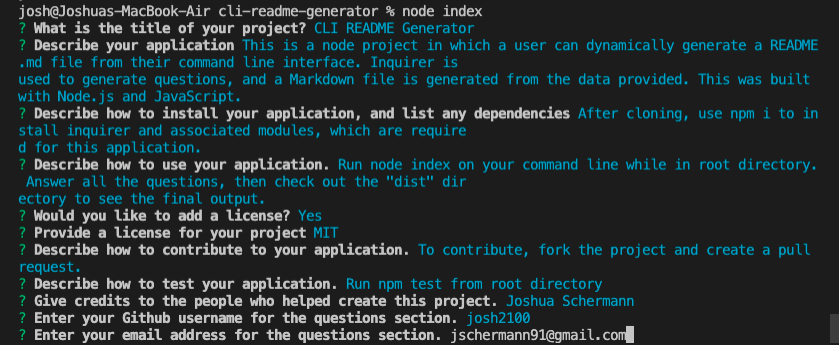

# CLI README Generator
Demo video at https://drive.google.com/file/d/143vyGXx1vpvwJtyKmEbKocH0Ub2kfVIS/view?usp=sharing

# Description

This is a node project in which a user can dynamically generate a README.md file from their command line interface. Inquirer is used to generate questions, and a Markdown file is generated from the data provided. This was built with Node.js and JavaScript.

## Table of Contents

- [Installation](#installation)
- [Usage](#usage)
- [License](#license)
- [Contributions](#contributions)
- [Credits](#credits)
- [Questions](#questions)

## Installation

Use npm install to install inquirer and associated modules, which are required for this application.

## Usage

Run node index on your command line while in root directory. Answer all the questions, then check out the "dist" directory to see the final output.

## License

This project is licensed under the MIT license.

## Contributions

Fork the project and create a pull request. Let me know how you think you can contribute and we will talk.

## Credits

Created by Joshua Schermann, special thanks to the University of Minnesota Coding Bootcamp

## Questions

Post an issue if you see a bug or suggested improvement.
